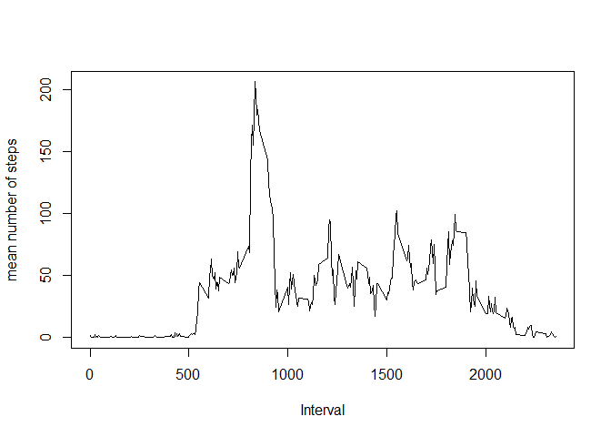

# Reproducible Research: Peer Assessment 1


## Loading and preprocessing the data

```r
# read the data in to dOrig and convert date variable
setwd("e:/_cloud-sync/Dropbox/coursera/datascience/5. Reproducilble Research/p1")
dOrig <- read.csv("./activity.csv")
dOrig$date <- as.Date(dOrig$date)

library(data.table)
library(ggplot2)

# store mean number of steps in a variable for later use
m <- mean(dOrig$steps, na.rm="true")

# create data table for Date data with basic total data and percent difference from mean for later use
dOrigDateSummary <- data.table(dOrig)
dOrigDateSummary <- dOrigDateSummary[,list(mean=as.numeric(mean(steps, na.rm="true")), 
               median=as.numeric(median(steps, na.rm="true")), 
               total=as.numeric(sum(steps, na.rm="true")), 
               percentDiffFromMean=as.numeric(mean(steps, na.rm="true")/m)
               ), 
         by=date]

# create data table for Interval data with basic total data and percent difference from mean for later use
dOrigIntSummary <- data.table(dOrig)
dOrigIntSummary <- dOrigIntSummary[,list(mean=as.numeric(mean(steps, na.rm="true")), 
               median=as.numeric(median(steps, na.rm="true")), 
               total=as.numeric(sum(steps, na.rm="true")), 
               percentDiffFromMean=as.numeric(mean(steps, na.rm="true")/m)
               ), 
         by=interval]
```


## What is mean total number of steps taken per day?

The total number of steps taken per day is shown by this histogram:


```r
hist(dOrigDateSummary$total, breaks=50, main="", xlab="Total number of steps", ylab="Frequency")
```

 

The mean total number of steps per day is:


```r
mean(dOrigDateSummary$total, na.rm="true")
```

```
## [1] 9354.23
```

The median total number of steps per day is:


```r
median(dOrigDateSummary$total, na.rm="true")
```

```
## [1] 10395
```


## What is the average daily activity pattern?

The following plot shows the average daily activity pattern:


```r
plot(dOrigIntSummary$interval, dOrigIntSummary$mean, type="l", xlab="Interval", ylab="mean number of steps")
```

 

The 5 minute interval with the highest average number of steps is:

```r
dOrigIntSummary[dOrigIntSummary$mean == max(dOrigIntSummary$mean),]$interval
```

```
## [1] 835
```

## Imputing missing values

The total number of missing values in the dataset is: 

```r
sum(is.na(dOrig$steps))
```

```
## [1] 2304
```

To fill in the missing values I will create a function that takes the mean number of steps per interval and multiply it by the percentage variance from the mean for the day and interval for which the value is being calculated.  I will then run this function on the missing date/interval pairs to fill in the values.


```r
# duplicate base data set
dCalc <- dOrig

# construct index of missing values
indxNA <- which(is.na(dCalc$steps))

# function to return calculated value of missing steps data
fCalcSteps <- function(thisDate, thisInterval){
    thisValue <- m
    if(dOrigDateSummary[dOrigDateSummary$date == thisDate]$total > 0){
        thisValue <- thisValue * dOrigDateSummary[dOrigDateSummary$date == thisDate]$percentDiffFromMean
    }
    if(dOrigIntSummary[dOrigIntSummary$interval == thisInterval]$total > 0){
        thisValue <- thisValue * dOrigIntSummary[dOrigIntSummary$interval == thisInterval]$percentDiffFromMean
    }
    thisValue
}

# loop through data set filling in the values
for(i in 1:length(indxNA)){
    dCalc[indxNA[i],]$steps <- fCalcSteps(dCalc[indxNA[i],]$date, dCalc[indxNA[i],]$interval)
}

# construct new data tables from calculated dataset
dCalcDateSummary <- data.table(dCalc)
dCalcDateSummary <- dCalcDateSummary[,list(total=sum(steps)), by=date]
```

Using the revised dataset the total number of steps taken per day is shown by this histogram:


```r
hist(dCalcDateSummary$total, breaks=50, main="", xlab="Total number of steps", ylab="Frequency")
```

 

The mean total number of steps per day is:


```r
mean(dCalcDateSummary$total, na.rm="true")
```

```
## [1] 10859.34
```

The median total number of steps per day is:


```r
median(dCalcDateSummary$total, na.rm="true")
```

```
## [1] 11458
```

These calculated values are higher than the original estimates.  Predictably adding values that are calcualted from the existing mean will increase the number of steps and thus the total, mean & median in the dataset compared with NULL values.

## Are there differences in activity patterns between weekdays and weekends?


```r
# create a factor for showing weekends
dCalc$IsWeekend <- as.factor(ifelse(weekdays(dCalc$date) %in% c("Saturday","Sunday"), "weekend", "weekday"))

#create data tables
dCalcIntSummary <- data.table(dCalc)
dCalcIntSummary <- dCalcIntSummary[,list(mean=mean(steps), IsWeekend=IsWeekend), by=interval]

dCalcIntSummaryDay <- data.table(dCalc[dCalc$IsWeekend=="weekday",])
dCalcIntSummaryDay <- dCalcIntSummaryDay[,list(mean=mean(steps)), by=interval]
dCalcIntSummaryEnd <- data.table(dCalc[dCalc$IsWeekend=="weekend",])
dCalcIntSummaryEnd <- dCalcIntSummaryEnd[,list(mean=mean(steps)), by=interval]


par(mfrow=c(2,1))
plot(dCalcIntSummaryDay$interval, dCalcIntSummaryDay$mean, type="l", main="average activity for weekdays", xlab="Interval", ylab="mean number of steps")
plot(dCalcIntSummaryEnd$interval, dCalcIntSummaryEnd$mean, type="l", main="average activity for weekends", xlab="Interval", ylab="mean number of steps")
```

 
